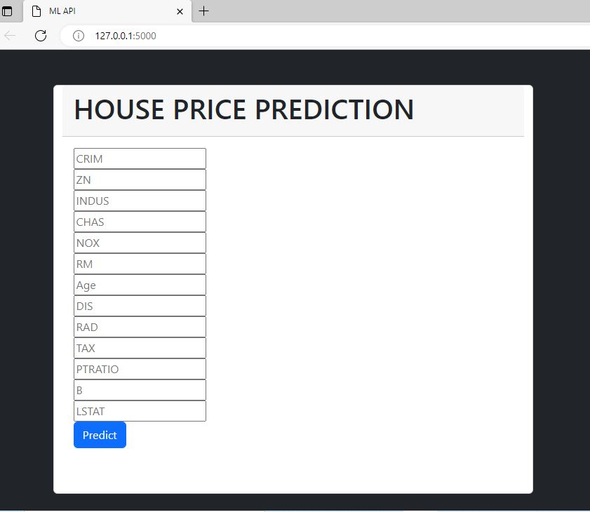

# Housepriceprediction
### An end-to-end project on predicting house price 
HousePricePrediction is an end-to-end project focused on predicting house prices using machine learning. The project also includes deployment of a web application for interactive predictions.

## Features

- Predicts house prices based on user input features.
- End-to-end workflow: data processing → model training → deployment.
- Interactive web application for real-time predictions.

## Software and Tools Requirements

- **Python 3**
- **VSCode IDE** – for development
- **Git CLI** – for version control
- **Heroku Account** – for deploying the web application
- **Machine Learning Libraries**: scikit-learn, pandas, numpy, matplotlib, etc.

# Final Webapp developed

